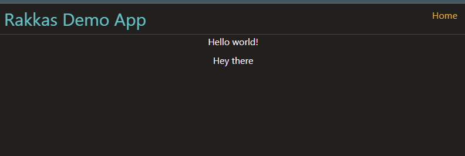

# TRPC + VITE + REACT 

## Setup using [Rakkasjs](https://rakkasjs.org/guide/what-is-rakkas)


##  initialize the project

```sh
pnpm create rakkas-app my-rakkas-app
```

### install the other dependencies 

**hattip**

what is [hattip](https://github.com/hattipjs/hattip)? ,
it's what powers the backend for Rakkasjs, and allows you to write code that'll run in multiple runtimes and environments, like node, bun,deno, and Cloudflare workers ... 

```sh
pnpm install hattip @hattip/response @hattip/cookie http-status-codes devalue
```

**trpc**

What is [trpc](https://trpc.io/docs)? , An easy way to write typesafe APIs in typescript, collocated backend, and frontend share types and give you a typesafe RPC API

```sh
pnpm install @trpc/client @trpc/react-query @trpc/server superjson zod
```

**prisma**

This one is optional as tprc doesn't necessarily need it , but we're trying to recreate the t3-stack which in Nextjs in vite + react, you can use whatever javascript orm / data source

```sh
pnpm install prisma
```

### Rakkasjs basics

What is [rakkasjs](https://rakkasjs.org/guide/what-is-rakkas)? , The closest thing to a Nextjs on Vite.


To get started we'll create the trpc API endpoint which will be a catch-all route with the `all` verb.

To create API routes in Rakkasjs we put it in the  `src/routes/api` directory, A simple API route would look something like this 

```ts
// src/routes/api/index.api.ts
import { json } from "@hattip/response";
import { StatusCodes } from "http-status-codes";
import { RequestContext } from "rakkasjs";

export async function get(ctx: RequestContext) {
try {
    return json({ message: "welcome to rakkas root api" },{ status: StatusCodes.ACCEPTED });
    } catch (error) {
    return json(error, { status: StatusCodes.BAD_REQUEST });    }
}

export async function post(ctx: RequestContext) {
    const body = await ctx.request.json();
    try {
        return json({body },{ status: StatusCodes.ACCEPTED });
    } catch (error) {
        return json(error,{ status: StatusCodes.BAD_REQUEST });
    }
}

```
we're going to be doing alot of relative imports so let's setup tsconfig aliases to point `@/` to `src/`

```json

{
  "compilerOptions": {
    "target": "es2020",
    "module": "ESNext",
    "esModuleInterop": true,
    "forceConsistentCasingInFileNames": true,
    "strict": true,
    "skipLibCheck": true,
    "moduleResolution": "Node",
    "resolveJsonModule": true,
    "jsx": "react-jsx",
    "baseUrl": ".",
    "types": ["vite/client"],

   
   "paths": {
      "@/*": ["src/*"]
    }


  }
}

```


Our trpc catch-all route
```ts
// src/routes/api/trpc/[...trpc].api.ts
import { fetchRequestHandler } from '@trpc/server/adapters/fetch';
import { RequestContext } from 'rakkasjs';
import { createTRPCContext } from '@/server/trpc';
import { appRouter } from '@/server/routes/root';

export async function all(ctx: RequestContext){
    return fetchRequestHandler({
        endpoint: '/api/trpc',
        req: ctx.request,
        router: appRouter,
        createContext:createTRPCContext,
    });
}
```
The only difference between this and the nextjs `create-t3-app` is that we're using the `fetchRequestHandler` instead of the nextjs adapter 

hattip like most of the other agnostic runtime servers relies on the standard fetch API.

### trpc setup
We'll put all the trpc logic in the `src/server` directory.

first, we'll create the trpc context
```ts
export function createTRPCContext({ req, resHeaders }: FetchCreateContextFnOptions) {
  const user = { name: req.headers.get('username') ?? 'anonymous' };
  // return createInnerTRPCContext({});
  return { req, resHeaders, user };
}

```

then we init trpc
```ts
const t = initTRPC.context<typeof createTRPCContext>().create({
  transformer: superjson,
  errorFormatter({ shape, error }) {
    return {
      ...shape,
      data: {
        ...shape.data,
        zodError:
          error.cause instanceof ZodError ? error.cause.flatten() : null,
      },
    };
  },
});
```

then we export the router and procedure

```ts
export const createTRPCRouter = t.router;
export const router = t.router
export const publicProcedure = t.procedure;
```

Then we can now create the trpc router + it's endpoints

```ts
// src/server/routes/root.ts
import { createTRPCRouter, publicProcedure } from '../trpc';
import { helloRouter } from './hello';
//  to test using a REST API client use a . to access nested routes insteda of a slash
//ex: http://localhost:5173/api/trpc/welcome
//ex: http://localhost:5173/api/trpc/hello.wave

export const appRouter = createTRPCRouter({
  hello:helloRouter,
});

// export type definition of API
export type AppRouter = typeof appRouter;

```

```ts
// src/server/routes/hello.ts
import { createTRPCRouter, publicProcedure } from "../trpc";
export const helloRouter = createTRPCRouter({
    hey: publicProcedure.query((opts) => {
        return `Hey there`;
    }),
    wave: publicProcedure.query(async(opts) => {
        return `🙋‍♀️`;
    }),

})
```
With thhat done , our endppoints are ready to consume on the frontend

lets add some frontend dependancies

```sh
pnpm install @tanstack/react-query react-toastify lucide-react @unpic/react tailwind-merge
```
Then we configure the trpc client in  `src/utils/trpc.ts`

```ts
// src/utils/trpc.ts
import type { AppRouter } from '@/server/routes/root';
import { createTRPCReact } from '@trpc/react-query';


export const trpc = createTRPCReact<AppRouter>();

```
Then we create a trpc client for the provider

```ts
// src/utils/client.ts
import { trpc } from "./trpc";
import { httpBatchLink } from "@trpc/react-query";
import superjson from "superjson";

const getBaseUrl = (url?:string) => {
    if (typeof window !== "undefined") return ""; // browser should use relative url
    const urlObj = new URL(url as string);
    if (process.env.VERCEL_URL) return `https://${process.env.VERCEL_URL}`; // SSR should use vercel url
    return urlObj.origin;
};


export const trpcClient = (url?:string)=>{
   return trpc.createClient({
        links: [
            httpBatchLink({
                url:`${getBaseUrl(url)}/api/trpc`,
            }),
        ],
        transformer: superjson
    });
}

```

Then we setup the stack react query provider

```tsx
// src/routes/layout.tsx
const [queryClient] = useState(() => new QueryClient());
...
return(
       <trpc.Provider client={trpcClient()} queryClient={queryClient}>
       <QueryClientProvider client={queryClient}>
         <section className="min-h-screen h-full w-full  ">{children}</section>
       </QueryClientProvider>
     </trpc.Provider>
)
```

> Rakkasjs has layouts , like the ones in nextjs app router which lets you wrap multiple pages with a commone layout , the one at the root `src/routes/layout.tsx` wraps the whole app so we can put our providers there

Let's add some tailwind for styling too [official guide](https://tailwindcss.com/docs/guides/vite)


```sh
pnpm i -D tailwindcss postcss autoprefixer daisyui  tailwindcss-animate tailwind-scrollbar tailwindcss-elevation prettier-plugin-tailwindcss
```
```sh
npx tailwindcss init -p
```

Now add the tailwind config content paths
```ts
/** @type {import('tailwindcss').Config} */
export default {
  content: [
    "./index.html",
    "./src/**/*.{js,ts,jsx,tsx}",
  ],
  theme: {
    extend: {},
  },
  plugins: [],
}
``` 


And include the base CSS in our layout 

`src/routes/index.css`
```css
@tailwind base;
@tailwind components;
@tailwind utilities;
```

```tsx
// src/routes/layout.tsx
import ./index.css

```

and now we consume our trpc endpoint 
```tsx
// src/routes/index.page.tsx
import { trpc } from "@/utils/trpc";

export default function HomePage() {
	const query = trpc.hello.hey.useQuery();
	return (
		<main className="flex flex-col gap-2 items-center">
			<h1>Hello world!</h1>
			<h3>{query?.data}</h3>
		</main>
	);
}

``` 
Taddah, Your app is now ready 



let's add the Prisma parts, first thing we need is a schema and the env variables
 `prisma/schema.prisma`

 ```ts
 // This is your Prisma schema file,
// learn more about it in the docs: https://pris.ly/d/prisma-schema

generator client {
  provider = "prisma-client-js"
}

generator zod {
  provider = "zod-prisma-types"
}

datasource db {
  provider = "sqlite"
  url      = env("DATABASE_URL")
}

model User {
  id        String   @id @default(cuid())
  name      String
  email     String
  password  String
  createdAt DateTime @default(now())
  updatedAt DateTime @updatedAt
}

model Post {
  id        String   @id @default(cuid())
  createdAt DateTime @default(now())
  updatedAt DateTime @updatedAt

  title String
  body  String
}

 ```

```sh
# .env
DATABASE_URL="file:./db.sqlite"
```

then we run the generate command
```sh
npx prisma generate
npx prisma migrate dev
```
and now we create a helper function for the db 
```ts
// src/server/db.ts
import { PrismaClient } from "@prisma/client";
import { envs } from "@/utils/env";

const globalForPrisma = globalThis as unknown as {
  prisma: PrismaClient | undefined;
};

export const prisma =
  globalForPrisma.prisma ??
  new PrismaClient({
    log:envs.DEV_MODE ? ["query", "error", "warn"] : ["error"],
      // env.NODE_ENV === "development" ? ["query", "error", "warn"] : ["error"],
  });

// if (env.NODE_ENV !== "production") globalForPrisma.prisma = prisma;
if (envs.PROD_MODE) globalForPrisma.prisma = prisma;

```

and we add prisma into our trpc context
```ts
export function createTRPCContext({ req, resHeaders }: FetchCreateContextFnOptions) {
  const user = { name: req.headers.get('username') ?? 'anonymous' };
  // return createInnerTRPCContext({});
  return { req, resHeaders, user,prisma };
}
```
We can now use it in our trpc routes 
```ts
// src/server/posts.ts

import { createTRPCRouter, publicProcedure } from "../trpc";
import { z } from "zod";

export const PostSchema = z.object({
    id: z.string().cuid().optional(),
    createdAt: z.coerce.date().optional(),
    updatedAt: z.coerce.date().optional(),
    title: z.string(),
    body: z.string(),
})

export type Post = z.infer<typeof PostSchema>

export const postRouter = createTRPCRouter({
    //  get the full list
    getFullList: publicProcedure.query(({ctx}) => {
        const posts = ctx.prisma.post.findMany();
        return posts;
    }),

    create: publicProcedure
    .input(PostSchema)
    .mutation(({ctx, input}) => {
        const post = ctx.prisma.post.create({
            data: input,
        });
        return post;
    }),

    update: publicProcedure
    .input(PostSchema)
    .mutation(({ctx, input}) => {
        const post = ctx.prisma.post.update({ where: {id: input.id},data: input,});
        return post;
    }),
    delete: publicProcedure
    .input(z.object({id: z.string()}))
    .mutation(({ctx, input}) => {
        const post = ctx.prisma.post.delete({ where: {id: input.id}});
        return post;
    })
})

// src/server/root.ts
export const appRouter = createTRPCRouter({
  hello:helloRouter,
  posts:postRouter
});


```

We can now consume it in the frontend
```tsx
// src/routes/posts
  const query = trpc.posts.getFullList.useQuery();
  return (
    <main className="flex flex-col gap-2 items-center">
      <h1>Hello world!</h1>
      <h3>{query?.data.map(...)}</h3>
    </main>
  );

```


That's all you need to get started, but we can optimize this further
For starters, we're not taking full advantage of the SSR step to preload the data.

Rakkasjs hasit;s built-in `useQuery` and `useServerSideQuery` hooks to preload the data during the SSR step.

but since we're using tanstack react query we can use the [integration guide](https://github.com/rakkasjs/tanstack-query) the creator put out that lets you prefetch the data in the SSR step 

we do this by adding Rakkasjs hoos hooks


- `client-entry.tsx` : Code here will run on/wrap  every page  We can move the providers from the layout to here
```tsx
/* eslint-disable no-var */
import { startClient } from "rakkasjs";
import { QueryClientProvider, QueryClient } from "@tanstack/react-query";
import { trpc } from "./utils/trpc";
import { trpcClient } from "./utils/client";


const queryClient = new QueryClient({
  defaultOptions: {
    queries: {
      suspense: true,
      staleTime: 100,
      refetchOnWindowFocus: false,
      refetchOnReconnect: false,
    },
  },
});

function setQueryData(data: Record<string, unknown>) {
  for (const [key, value] of Object.entries(data)) {
    queryClient.setQueryData(JSON.parse(key), value, { updatedAt: Date.now() });
  }
}

declare global {
  var $TQD: Record<string, unknown> | undefined;
  var $TQS: typeof setQueryData;
}

// Insert data that was already streamed before this point
setQueryData(globalThis.$TQD ?? {});
// Delete the global variable so that it doesn't get serialized again
delete globalThis.$TQD;
// From now on, insert data directly
globalThis.$TQS = setQueryData;

startClient({
  hooks: {
    wrapApp(app) {
      return (
            <trpc.Provider client={trpcClient()} queryClient={queryClient}>
              <QueryClientProvider client={queryClient}>{app}</QueryClientProvider>
            </trpc.Provider>
      );
    },
  },
});

```

- `hattip-entry.tsx` 
 We also need to create  server-side providers
```tsx
import { RequestContext, createRequestHandler } from "rakkasjs";
import { cookie } from "@hattip/cookie";

import {
  QueryCache,
  QueryClient,
  QueryClientProvider,
} from "@tanstack/react-query";
import { uneval } from "devalue";
import { trpc } from "./utils/trpc";
import { trpcClient } from "./utils/client";

declare module "rakkasjs" {
  interface ServerSideLocals {
    session: any;
  }
}

type CreateRequestHandlerParams = Parameters<typeof createRequestHandler>;

const attachSession = async (ctx: RequestContext) => {
  try {
    // ctx.locals.session = await getSession(
    //     ctx.platform.request,
    //     ctx.platform.response
    // );

    ctx.locals.session = {
      user: "jeffery",
    };
  } catch (error) {
    throw new Error("Failed to attach session");
  }
};
const logger = async (ctx: RequestContext) => {
  try {
    console.log("========", ctx.ip, "=============");
  } catch (error) {
    throw new Error("Failed to attach session");
  }
};

export default createRequestHandler({
  middleware: {
    // HatTip middleware to be injected
    // before the page routes handler.
    // @ts-expect-error
    beforePages: [cookie(), attachSession],
    // HatTip middleware to be injected
    // after the page routes handler but
    // before the API routes handler
    beforeApiRoutes: [logger],
    // HatTip middleware to be injected
    // after the API routes handler but
    // before the 404 handler
    beforeNotFound: [],
  },

  createPageHooks(ctx) {
    let queries = Object.create(null);
    console.log("hattip ctx", ctx.request.url);
    return {
      wrapApp(app) {
        const queryCache = new QueryCache({
          onSuccess(data, query) {
            // Store newly fetched data
            queries[query.queryHash] = data;
          },
        });

        const queryClient = new QueryClient({
          queryCache,
          defaultOptions: {
            queries: {
              suspense: true,
              staleTime: Infinity,
              refetchOnWindowFocus: false,
              refetchOnReconnect: false,
            },
          },
        });

        return (
          <trpc.Provider
            client={trpcClient(ctx.request.url)}
            queryClient={queryClient}
          >
            <QueryClientProvider client={queryClient}>
              {app}
            </QueryClientProvider>
          </trpc.Provider>
        );
      },

      emitToDocumentHead() {
        return `<script>$TQD=Object.create(null);$TQS=data=>Object.assign($TQD,data);</script>`;
      },

      emitBeforeSsrChunk() {
        if (Object.keys(queries).length === 0) return "";

        // Emit a script that calls the global $TQS function with the
        // newly fetched query data.

        const queriesString = uneval(queries);
        queries = Object.create(null);
        return `<script>$TQS(${queriesString})</script>`;
      },
    };
  },
});

```

 - `src/common-hooks.tsx` : is also an option but we won't use it here

The hooks also allow you to define middleware and locals for things like sessions which can be shared between pages and API routes

That's it, now we build a CLI, but that's for another day

[rtemplate repository](https://github.com/rakkasjs/rtemplate)
